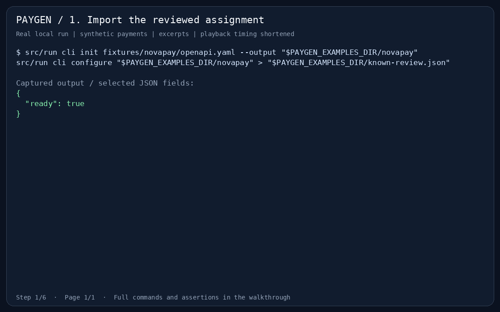
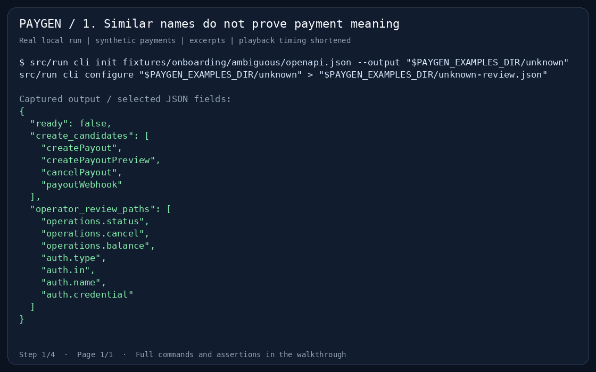

# Run the datasets yourself

This walkthrough uses the fictional NovaPay assignment and an intentionally
ambiguous version of it. Every payment request stays on loopback and uses
synthetic data. The example verifier runs the same commands shown below.

Complete [Ruby toolchain setup](development.md#toolchain), install Bash and curl,
and run `src/run setup` from the repository root. Start with a fresh directory:

```bash
export PAYGEN_EXAMPLES_DIR=$(mktemp -d)
export PAYGEN_DEMO_PORT=9293
export PAYGEN_SIMULATOR_PORT=9292
```

## Watch the recorded runs

These GIFs show terminal output captured during a passing local run. They include
selected JSON fields, play faster than the original session and display temporary
paths as `$PAYGEN_EXAMPLES_DIR`. They do not show the browser panel. You can run
the complete commands in the sections that follow.







[Static frame](media/dataset-examples/confirmed-contract-poster.png) ·
[Text transcript](media/dataset-examples/confirmed-contract.txt)







[Static frame](media/dataset-examples/operator-review-poster.png) ·
[Text transcript](media/dataset-examples/operator-review.txt) ·
[Capture hashes](media/dataset-examples/capture-manifest.json)

## A confirmed contract: NovaPay

<!-- verify: known-init -->
```bash
src/run cli init fixtures/novapay/openapi.yaml --output "$PAYGEN_EXAMPLES_DIR/novapay"
src/run cli configure "$PAYGEN_EXAMPLES_DIR/novapay" > "$PAYGEN_EXAMPLES_DIR/known-review.json"
```

`known-review.json` reports `ready: true`. The bundled recipe supplies explicit,
reviewed decisions; this is not evidence that names alone reveal payment meaning.
The assignment is pinned as normalized `source/openapi.json`, and its corrections live in an Overlay.

| Decision | NovaPay contract and reviewed profile |
| --- | --- |
| Creation | `createPayout` sends the payout; acceptance is not settlement |
| Amount | Application `"1500.00"` RUB becomes integer `150000` kopecks; the minimum `100000` is in provider units |
| Recipient | SBP needs phone and bank code; card needs card number; conflicting phone fallbacks require an explicit choice |
| Settlement | `pending` and `processing` remain `in_progress`; only `completed` becomes `approved` |
| Identity | Response reference, amount and currency must match this operation |
| Retry | An idempotency header without a documented retention guarantee does not authorize retry after an ambiguous create |
| Callback | Verify HMAC-SHA256 over the raw body with the reviewed signature encoding before trusting state |

<!-- verify: known-generate -->
```bash
src/run cli generate "$PAYGEN_EXAMPLES_DIR/novapay"
src/run cli diff "$PAYGEN_EXAMPLES_DIR/novapay" --check
src/run cli verify "$PAYGEN_EXAMPLES_DIR/novapay" --seed 42 > "$PAYGEN_EXAMPLES_DIR/known-verify.json"
```

Expect unchanged generated files, `success: true` and `failed: 0`. Verification
covers fault cases as well as success; it is not a bank sandbox certification.

### Export the adapter and its documentation

<!-- verify: known-export -->
```bash
src/run cli export "$PAYGEN_EXAMPLES_DIR/novapay" --standalone --output "$PAYGEN_EXAMPLES_DIR/adapter"
src/run cli docs "$PAYGEN_EXAMPLES_DIR/novapay" --format html --output "$PAYGEN_EXAMPLES_DIR/guide"
src/run cli collection "$PAYGEN_EXAMPLES_DIR/novapay" --format bruno --output "$PAYGEN_EXAMPLES_DIR/bruno"
```

Open `$PAYGEN_EXAMPLES_DIR/guide/index.html`. This portable integration guide is
generated from the same effective contract as the adapter and includes examples.
It needs no Node runtime. The Paygen manual you are reading is a separate Diplodoc
site built with pnpm.

The standalone export includes runtime source for embedding in a Ruby application.
Your application supplies `Provider::BaseService`, the documented backend hooks,
credentials, transport and durable operation state. Read its `INTEGRATION.md`
before wiring it in. Retain the original project for regeneration and later
`docs`, `demo` or `serve` commands: the detached export is user-owned source,
not a new generator project with automatically synchronized edits.

### `demo` and `serve` do different jobs

| Command | Interface | What it exercises |
| --- | --- | --- |
| `demo PROJECT` | Browser panel and application operations (`/operations`, `/sample`, `/evidence`) | Application request → generated Ruby adapter → local provider simulator; verified callbacks return through the adapter |
| `serve PROJECT` | Provider-shaped HTTP API (NovaPay `/payouts`, provider authentication and wire fields) | A standalone mock gateway for a client or `verify --target`; it does not invoke the generated adapter itself |

Both run in memory on loopback, use synthetic credentials and clear state on
restart. Neither connects to a bank or serves the exported HTML documentation.

In the first terminal, start the application demo:

<!-- verify-server: demo -->
```bash
src/run cli demo "$PAYGEN_EXAMPLES_DIR/novapay" --seed 42 --port "$PAYGEN_DEMO_PORT"
```

Open `http://127.0.0.1:9293/` for the panel. In a second terminal, export the same
three variables and run:

<!-- verify: demo-payment -->
```bash
curl --noproxy '*' --fail-with-body -sS "http://127.0.0.1:$PAYGEN_DEMO_PORT/operations" \
  -H 'Content-Type: application/json' \
  -d '{"id":"walkthrough-1","amount":"1500.00","currency":"RUB","payout_requisite":{"sbp":{"phone":"79990000001","bank_code":"000000000"}}}' \
  > "$PAYGEN_EXAMPLES_DIR/create.json"
curl --noproxy '*' --fail-with-body -sS "http://127.0.0.1:$PAYGEN_DEMO_PORT/operations/walkthrough-1/retry" \
  -H 'Content-Type: application/json' -d '{}' > "$PAYGEN_EXAMPLES_DIR/retry.json"
curl --noproxy '*' --fail-with-body -sS "http://127.0.0.1:$PAYGEN_DEMO_PORT/operations/walkthrough-1" > "$PAYGEN_EXAMPLES_DIR/poll-1.json"
curl --noproxy '*' --fail-with-body -sS "http://127.0.0.1:$PAYGEN_DEMO_PORT/operations/walkthrough-1" > "$PAYGEN_EXAMPLES_DIR/poll-2.json"
curl --noproxy '*' --fail-with-body -sS "http://127.0.0.1:$PAYGEN_DEMO_PORT/evidence" > "$PAYGEN_EXAMPLES_DIR/evidence.json"
```

Creation returns `in_progress`; retry retains the same `provider_id`; polling
returns `in_progress` and then `approved`. Evidence contains `created_count: 1`.
The verifier below asserts these facts, rather than accepting any HTTP 200.

Stop `demo` with Ctrl-C. Start the provider mock in the first terminal:

<!-- verify-server: serve -->
```bash
src/run cli serve "$PAYGEN_EXAMPLES_DIR/novapay" --seed 42 --port "$PAYGEN_SIMULATOR_PORT"
```

In the second terminal, exercise the generated adapter against this HTTP gateway:

<!-- verify: serve-client -->
```bash
src/run cli verify "$PAYGEN_EXAMPLES_DIR/novapay" --target "http://127.0.0.1:$PAYGEN_SIMULATOR_PORT" --seed 42 > "$PAYGEN_EXAMPLES_DIR/http-verify.json"
```

Expect `success: true` and `failed: 0`. Stop `serve` with Ctrl-C. For callback
requests and timeout-after-commit behavior, continue with the
[base run](demo.md) and [Bruno collection](bruno-demo.md).

## An ambiguous contract: an operator must decide

The fixture in `fixtures/onboarding/ambiguous/` adds `createPayoutPreview`, which
validates a preview but never sends money. Its source provenance identifies this
synthetic modification. Two similar operation names cannot resolve their business
meaning. The changed title also prevents matching the NovaPay recipe.

<!-- verify: unknown-init -->
```bash
src/run cli init fixtures/onboarding/ambiguous/openapi.json --output "$PAYGEN_EXAMPLES_DIR/unknown"
src/run cli configure "$PAYGEN_EXAMPLES_DIR/unknown" > "$PAYGEN_EXAMPLES_DIR/unknown-review.json"
```

Expect `ready: false`. The report offers candidates and points to their source;
creation is unresolved. Safe naming defaults may come from the title. Inferred
payment roles and authentication remain suggestions with
`OPERATOR_REVIEW_REQUIRED` blockers. `init` does not save those guesses as if
an operator supplied them.

The next command is an **expected failure**, exit code **4**:

<!-- verify: unknown-blocked exit=4 -->
```bash
src/run cli generate "$PAYGEN_EXAMPLES_DIR/unknown"
```

A diagnostic draft remains useful for inspection, but contains no executable
Ruby service. Structural inspection is allowed; running adapter verification or
starting a mock with unresolved semantics is not.

<!-- verify: unknown-draft -->
```bash
src/run cli generate "$PAYGEN_EXAMPLES_DIR/unknown" --draft
```

Each of these commands must fail with exit **4**:

<!-- verify: unknown-verify exit=4 -->
```bash
src/run cli verify "$PAYGEN_EXAMPLES_DIR/unknown" --seed 42
```

<!-- verify: unknown-demo exit=4 -->
```bash
src/run cli demo "$PAYGEN_EXAMPLES_DIR/unknown" --port "$PAYGEN_DEMO_PORT"
```

<!-- verify: unknown-serve exit=4 -->
```bash
src/run cli serve "$PAYGEN_EXAMPLES_DIR/unknown" --port "$PAYGEN_SIMULATOR_PORT"
```

Supplying amount and status semantics alone must not accidentally approve the
remaining inferred fields:

<!-- verify: partial-review -->
```bash
src/run cli configure "$PAYGEN_EXAMPLES_DIR/unknown" --answers fixtures/onboarding/ambiguous/partial-answers.yml > "$PAYGEN_EXAMPLES_DIR/partial-review.json"
```

Expect `ready: false`. Review each critical field against the contract, then
write explicit answers. This exercise's `answers.yml` selects `createPayout`,
confirms each supported role and header credential, and supplies the monetary,
response and signature decisions listed above. An optional role can be explicitly
set to `null`; a required creation role cannot. There is no blanket approval flag.

<!-- verify: resolved-review -->
```bash
cp fixtures/onboarding/ambiguous/overlay.yaml "$PAYGEN_EXAMPLES_DIR/unknown/overlays/010-reviewed.yaml"
src/run cli configure "$PAYGEN_EXAMPLES_DIR/unknown" --answers fixtures/onboarding/ambiguous/answers.yml > "$PAYGEN_EXAMPLES_DIR/resolved-review.json"
src/run cli generate "$PAYGEN_EXAMPLES_DIR/unknown"
src/run cli verify "$PAYGEN_EXAMPLES_DIR/unknown" --seed 42 > "$PAYGEN_EXAMPLES_DIR/resolved-verify.json"
src/run cli docs "$PAYGEN_EXAMPLES_DIR/unknown" --format html --output "$PAYGEN_EXAMPLES_DIR/resolved-guide"
```

Now expect `ready: true`, a `training_service.rb` and successful verification.
The pinned source bytes remain unchanged. The operator changes a profile and
Overlay, not the source specification. Do not reuse these fixture answers for an
unrelated provider. Projects without `review.json` have unknown review history and require explicit
reconfirmation through `configure --answers` before executable generation. See
[saved decisions and migration](native-onboarding.md#saved-decisions-and-changed-contracts).

## Verify every supported dataset and this walkthrough

From the repository root, one command runs the marked blocks above, asserts both
success and refusal outcomes, manages its own local servers, and independently
builds all **seven executable dataset profiles** twice. It compares SHA-256 for
every generated file, HTML/Markdown guide and Bruno collection, then verifies each
adapter with seed 42. This covers NovaPay, compact PayPal/Stripe/Adyen, native
Paystack/PayPal and Raiffeisen; the wider import corpus is not seven ready adapters.

```bash
src/run exec ruby docs/scripts/verify-examples.rb
```

Reports and captured command output are written under `tmp/docs-examples/`.
The runner executes the explicitly marked blocks in this page; placeholder
commands in API reference sections are not claimed as executable tests.
To also rebuild and check the complete published manual:

```bash
pnpm --dir docs install --frozen-lockfile --ignore-scripts
pnpm --dir docs run docs:test
pnpm --dir docs run docs:build
```

Determinism means identical pinned source, Overlay, profile, generator version
and dependencies produce identical artifacts. A fixed seed reproduces simulator
behavior; it does not predict responses from a live provider.
