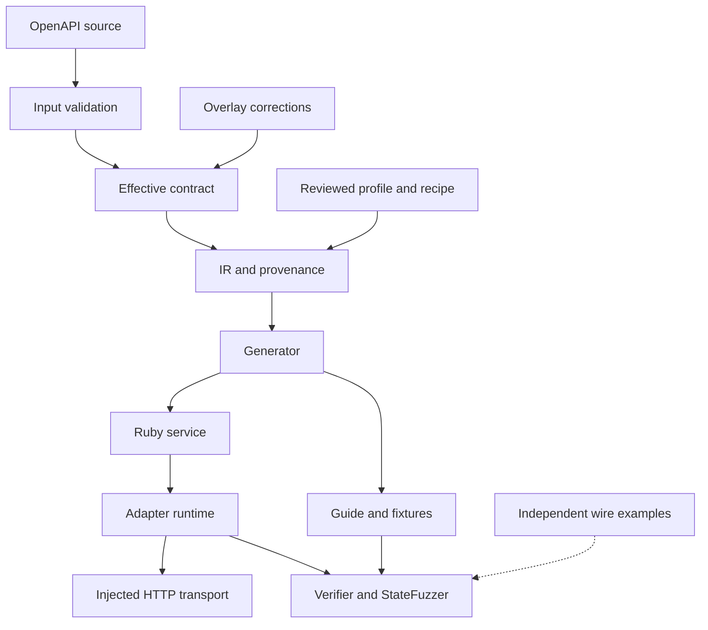
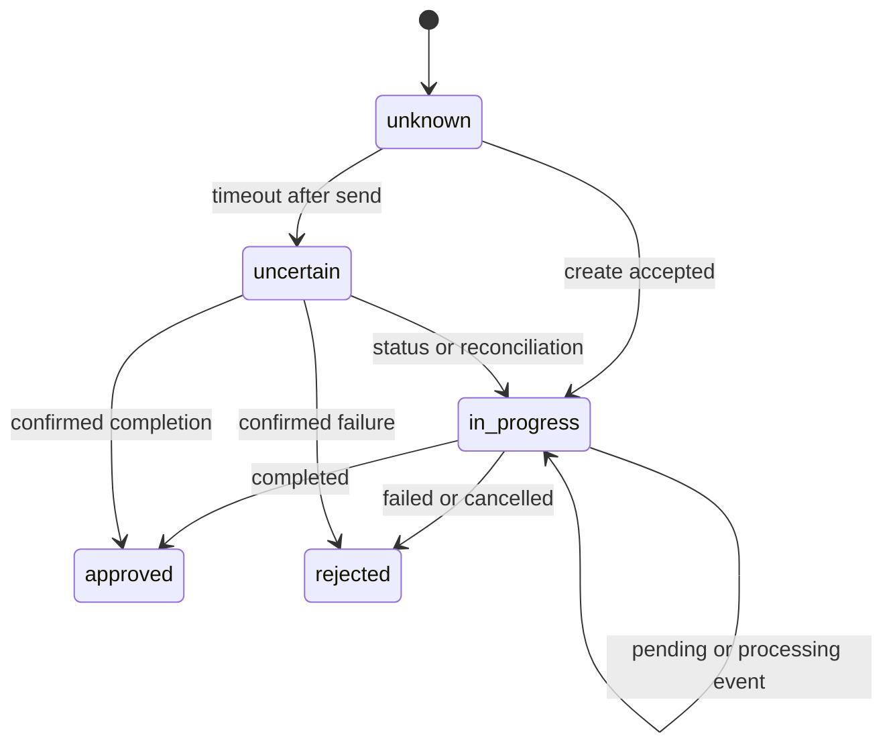

# Paygen: from a machine-readable contract to a verifiable Ruby adapter

**Research status:** updated during integration on 6 September 2026. Historical
baseline `92ef59bc2c8eb102c7452136ee4ea8a46887fd52` is retained separately from
E02–E05, independent acceptance and mutation/replay evidence. Each result belongs
to its recorded SHA and evidence. A release report must verify the final assembled
version. Optional E06/E08 remain NOT_RUN and do not block prototype acceptance.

## Team summary

Paygen addresses a bounded task: turn an OpenAPI contract and explicit domain
decisions into a consistent Ruby service, `INTEGRATION.md`, `fixtures.json` and
supporting artifacts, then execute the adapter against a local HTTP simulator
with fixed and sequence-based checks. [CASE] The target service interface includes
`check_conditions`, `create_request`, `fetch_status` and `process_callback`;
the implementation must remain Ruby, without ML in the product. [Q&A] Logical
`request_method` is not an HTTP verb, a production `BaseService` is not supplied,
and NovaPay signatures use the exact body bytes.

OpenAPI supplies HTTP structure but cannot safely establish all payment semantics.
Amount units, status mappings, conditional recipient requirements, idempotency
scope, callback signatures and ambiguous-outcome policies need a reviewed profile
or recipe. Missing decisions must remain visible diagnostics. [PROJECT POLICY]
Unknown states are not successes, major-to-minor conversion avoids `Float`, and
missing signature evidence cannot be replaced by permissive fallback behavior.

The pipeline is Input → Overlay → IR/profile/provenance → Generator →
Adapter/Simulator/Verifier/StateFuzzer. The historical full RSpec run produced
1119 examples without failures at seed 1016, with 89.46% line and 74.76% branch
coverage. Separate later evidence covers acceptance 6/6, showcase 150 checks and
E02–E05. These are different sets at different SHAs, not one combined test count.
Of the RSpec examples, 703 belong to JSONPath compliance. Local results do not
establish private-backend compatibility, provider sandbox acceptance, settlement,
PCI DSS compliance or cross-process exactly-once behavior.

The contribution is a reviewable record of decisions: preserved source,
separate Overlay corrections, provenance for winning semantic facts, and one
effective contract producing code, docs and fixtures. This reduces accidental
artifact drift but retains the risk of a shared semantic mistake. Independent
wire examples, negative controls and real sandbox checks remain necessary.

## 1. Problem statement

A payment integration joins the provider's HTTP contract—paths, methods,
parameters, schemas, security and responses—to a host application's operation
lifecycle, statuses and callback interface. [CASE] NovaPay requires payout creation,
status, cancellation, an incoming webhook and balance. Authentication uses
`X-API-Key`; currency is RUB and the minimum creation amount is 100000 kopecks.
Recipients have `sbp` and `card` branches: phone is required, with `bank_code` for
SBP and `card_number` for cards. `pending`/`processing` map to `in_progress`,
`completed` to `approved`, and `failed`/`cancelled` to `rejected`.

The hackathon deliverable is an understandable CLI and three primary generated
artifacts. [CASE] The quoted manual-integration estimate of 2–5 days belongs to
the case description; it is not a measured Paygen time saving. [Q&A] A CLI is
sufficient for interface assessment; a web interface is optional. [CASE] Expert
checkpoint priorities total 100, while the listed technical-jury maxima total 103
despite a stated total of 100. This discrepancy is retained, not converted into
a new scoring system.

A generated class and reference harness are not a production integration. The
private `Provider::BaseService` exception behavior, transactions and interface
are unknown, and organizers need not provide a harness. The explicit
`process_callback(payload, raw_body:, headers:)` hook permits exact-byte signature
verification. [PROJECT POLICY] Host adaptation must be agreed separately;
compatibility must not be achieved by disabling authenticity checks.

## 2. Domain and uncertainty

A payment transfers value from a payer; a payout sends funds to a recipient.
A provider is an external system; an adapter translates host commands to wire
requests and provider responses/events back to domain results. These definitions
do not make APIs interchangeable. A payout can be accepted but not executed or
settled: HTTP 2xx may acknowledge a command only. Later rejection, cancellation or
reversal is possible. Approval therefore requires an explicit status rule.

Money needs a value, currency and unit. `1000` is ambiguous without currency and
major/minor units. Binary `Float` and implicit rounding can change the smallest
unit. Paygen uses `BigDecimal` for exact conversion and explicit scale policy.
Permitted precision and nonintegral minor-unit results must be handled explicitly;
the conservative default is rejection instead of hidden rounding.

Idempotency involves key scope (credential/account/operation/action), retention,
payload comparison and durable storage. A timeout after sending is ambiguous:
the provider may have committed the payout. A repeat without reconciliation can
create another payment. In-memory storage cannot coordinate independent workers.
Repeating an ambiguous create requires a documented provider guarantee; otherwise
status lookup and reconciliation are necessary.

Webhooks are untrusted input. Verification uses exact raw body bytes, the required
headers and secret, constant-time MAC comparison, then replay-window, event-ID
and ordering rules. Deduplicating by normalized status alone is insufficient:
`pending` and `processing` both map to `in_progress` but may carry distinct
metadata. A callback response does not itself prove durable event persistence.

Validation, authentication, rate limiting, business rejection, transient transport
errors and ambiguous outcomes require different retry policies. Unknown statuses
cannot default to success. Schema checks validate shape, not field meaning,
credential authority or actual money movement.

## 3. Automation boundary

The first layer is syntax and structure: safe YAML/JSON parsing, OpenAPI version
detection, local reference resolution, schema validation and extraction of
operations, parameters, media types and security declarations. Descriptions and
examples are data, not executable instructions. Remote references require an
explicit network capability; uploaded server URLs do not authorize network calls.

The semantic profile binds provider fields to amount, currency, operation identity
and recipient; defines units, scale, status mapping, `required_if`, signatures and
logical actions. [Q&A] General overrides such as `amount_unit`, `required_if` and
`signature_encoding` are allowed; provider-specific core hardcoding is not.
Explicit decisions are reviewable, traceable and rejectable. There is no runtime
LLM: beyond the case requirement, probabilistic critical-policy inference would
undermine repeatable verification.

Runtime policy is the third layer: transport timeouts, retry allowlists, state
keys, clocks, verification and reconciliation. OpenAPI alone cannot determine it.
Incomplete input should produce diagnostics or an unsupported result, not a
plausible guess. OpenAPI 3.0/3.1, local references, Overlay 1.1 and limited Arazzo
support form a finite capability set, not a promise to accept any OpenAPI or PDF.

## 4. Architecture and trust boundaries

`Core::Input` bounds size and depth, safely parses YAML/JSON and controls reference
resolution. This deliberately excludes implicit remote retrieval. JSONSchemer
validates OpenAPI and schemas but does not supply semantic bindings. OpenAPI 3.0
and 3.1 use different schema dialects; 3.0 must not inherit the entire JSON Schema
2020-12 feature set by assumption.

Overlay preserves source and records ordered changes. Janeway provides RFC 9535
JSONPath rather than an ad hoc selector subset. Overlay validation, complexity
limits and unmatched-target diagnostics remain necessary. Editing a source copy
would be simpler, but would obscure upstream facts versus team decisions and
complicate snapshot updates.

IR combines inference, vendor extensions, recipes and profiles with provenance
for winning values. It is a normalized Ruby Hash representation, not an immutable
typed IR. One generator uses the effective configuration for Ruby, guides and
fixtures. A hash manifest detects generated edits; user-owned `extensions/` are
preserved and never executed during generation. Three independent template
pipelines would require manual synchronization and still carry semantic risks.

The adapter separates transport, clock and state storage so checks can observe
request bytes, inject timeouts and control callback time without real payments.
OpenSSL provides HMAC and BigDecimal provides exact amounts. Simulator models a
provider; Demo actually invokes the generated adapter and simulator. Rack/Puma
provides the loopback HTTP boundary. A direct mock response is not equivalent
execution evidence, and the reference BaseService does not establish compatibility
with an unknown production interface.

Verifier combines schema and semantic assertions with negative scenarios.
StateFuzzer generates bounded action sequences, checks state invariants, shrinks
failures and replays them. Its generator and shrinker are custom; PropCheck powers
separate RSpec properties. A shrunk counterexample is shorter, not necessarily
globally minimal.

### 4.1. Rejected simplifications

A single provider-specific Ruby template would be faster for NovaPay but would
embed mappings in code and provide no general artifact-consistency mechanism.
An OpenAPI SDK generator handles typed HTTP clients but does not select payment
status semantics, idempotency scope or the host's raw-callback interface. Paygen
adds a controlled semantic and verification layer for this Ruby contract rather
than competing on the number of supported output languages.

Extracting critical policy from prose keywords was also rejected. Negation,
localization and ambiguity make it unreliable. Descriptions remain evidence, not
policy. Allowing unsigned callbacks or retries after every timeout would make a
demo easier but violate the payment-safety requirements.

## 5. Research questions and protocol

| ID | Question and operational definition | Experiment | Metric | Limitation |
| --- | --- | --- | --- | --- |
| RQ1 | Which facts are structural and which require a profile? Extraction means the same IR fact without provider hardcoding. | Remove semantic bindings in focused/native OpenAPI 3.0/3.1 inputs and compare diagnostics. | Inference versus profile origins; blockers and warnings. | Finite corpus, not every API. |
| RQ2 | Does one contract reduce divergence among three artifacts? | Generate pinned source/profile/version twice; change a mapping and independently inspect code/docs/fixtures. | Byte equality, inconsistent assertions and drift outcomes. | Consistency can reproduce the same mistake. |
| RQ3 | Can a different provider be onboarded without a core patch? | Native PayPal/Paystack snapshots and profiles; `git diff -- src/lib/`. | Executable profiles, core diff and unsupported diagnostics. | Not arbitrary-provider support or production readiness. |
| RQ4 | Which defects does state testing additionally detect? | Predetermined mutation set, fixed examples, matched-budget stateless control and stateful sequences using equal budgets/seeds. | Unique mutation kills, trace reduction and replay rate. | Few seeds are not exhaustive; causal claims need a matched control. |
| RQ5 | Which errors are rejected before side effects? | Invalid schema/amount/recipient/signature with instrumented transport/store. | Invalid cases with zero transport calls and provider mutations. | Does not measure real provider validation. |

Pin datasets by filename, SHA-256, license/provenance and tested commit. Distinguish
focused NovaPay, Stripe, Adyen and PayPal contracts, Raiffeisen's full-contract
profile, native PayPal/Paystack imports, and review-only T-Bank/Tochka. Independent
wire expectations must not be generated from the same fixtures. Fix the faulty
corpus and mutation set before running, including unfavorable cases. Measure cold
empty-cache setup separately from warm startup; one timing is not general evidence.

## 6. Observations and evidence levels

The historical full RSpec baseline at `92ef59b…` used Linux x86_64, Ruby 3.4.4,
seed 1016 and WebMock with localhost enabled. It recorded **1119 examples,
0 failures**, 96.69 seconds inside RSpec, line coverage 4098/4581 = 89.46%, and
branch coverage 1884/2520 = 74.76%. Raw log and exit code are in
`research/evidence/`. **703 examples are JSONPath compliance cases**. The integrator
reported an intermediate 1141/0, seed 42570 at `09013a6…` without a retained raw
log; that is REPORTED, not archived final-version evidence.

Historical availability checks returned HTTP 200 for 11 primary URLs. This proves
access at that time, not every associated claim. Code and lockfiles establish
actual use of Ruby, JSONSchemer, Janeway, BigDecimal/OpenSSL,
RSpec/WebMock/PropCheck, Rack/Puma and Diplodoc. Seven executable profiles and
native imports describe different classifications; reviews and corpus entries
must not be counted as completed integrations.

`script/research-experiments` executes E02–E05: two independently generated
directories; semantic comparisons for equivalent YAML/JSON; generated-drift
refusal and extension preservation; native PayPal/Paystack generation and
independent HTTP examples without core changes. Provenance bytes are not compared
as business semantics. SHAs, commands, environment, input/output hashes and logs
are saved under `tmp/research-experiments/`.

On clean `b878e17…`, independent acceptance executed **6/6 probes** covering five
baseline defects: tenant scope and rotation, workflow output preflight, distinct
progress callbacks, decimal type preservation and root back-references. This is
post-fix evidence for those cases, not a new historical red/green comparison.
A subsequent merge needs another acceptance run.

Showcase on clean `75e0331…` executed **150 PASS checks**, counting commands and
assertions. E07 supplies a real negative control: a disposable subprocess with a
broken create reservation produced two provider commits. At seed 4242,
StateFuzzer saved a 20-action trace and shrank it to 2. Mutant replay again found
`duplicate_payout`; the unchanged adapter passed the same persisted trace and
profile hash. This demonstrates generation, shrinking and replay for one mutation,
not sensitivity across a full mutation corpus.

The result matrix and early integration hashes are in [EXPERIMENTS.md](EXPERIMENTS.md)
and the [observation record](evidence/INTEGRATION_OBSERVATIONS.md). E06
(matched-budget comparison) and E08 (cold/warm timings) remain **NOT_RUN, optional
future studies**. Superiority, measured development speedup and completion of the
whole research program are not established. Documentation and container PASS
require actual logs for the release under review, not merely workflow files.

## 7. Validity and security limits

**Internal validity.** Generator, simulator, docs and fixtures share a profile.
Agreement among them is not independent verification. Independent wire examples
reduce risk but can still share a misreading of provider documentation. Sandbox
checks and confirmation by the API owner remain external steps.

**External validity.** The corpus is small and curated. Several distinct contracts
demonstrate portability for those cases, not universality. Full OpenAPI, Overlay
and Arazzo feature coverage is not implied. Private BaseService behavior, real
credential scopes, sandbox outcomes, settlement and reversal remain unverified.

**Construct validity.** Additional defects found by stateful testing might reflect
a larger budget. A matched-budget stateless control is needed. Coverage measures
executed code, not all business states. Successful loopback HTTP verifies the
transport path, not a funds transfer.

**Reproducibility.** Record seeds and total action budgets; one seed does not
cover all states. Call traces reduced, not minimal. Timings depend on CPU,
filesystem, gem/pnpm caches and network. Results for a merge require execution
at that merge SHA.

**Threat model.** Specifications, profiles, overlays and Arazzo documents are
untrusted data. Parsers need limits and timeouts; references and server declarations
must not silently authorize network access. YAML does not execute Ruby. Extensions
are trusted application code explicitly loaded by the host. Secrets, real PAN/CVV
and callback bodies must not enter documentation or logs. Only labeled synthetic
cards are acceptable test data. Replay retains fixture identity/version/hash,
not irreversibly masked input. Verify HMAC before trusting the payload; unknown
signature encodings block callback verification.

Encryption or masking alone does not remove PCI DSS scope, which depends on
actual architecture and applicable requirements. This prototype does not claim
PCI compliance. Cross-process exactly-once claims require durable coordination,
a crash model and a transaction contract; default in-memory storage is insufficient.

## 8. Conclusions and bounded roadmap

Paygen demonstrates a practical integration pipeline: machine-readable structure,
reviewed domain profiles, separate upstream corrections, traceable provenance,
consistent generated artifacts and observable transport/state/clock boundaries.
Verification and bounded state fuzzing exercise positive and negative paths.
The contribution beyond SDK generation is the explicit payment bindings,
raw-callback interface, state policies and matching documentation/fixtures for
the target Ruby contract.

The workflow is: pin source and hash; inspect diagnostics; apply reviewable
corrections; complete the profile; generate and check drift; execute through the
loopback simulator; run independent vectors, faults and replay; agree backend
hooks; verify the provider sandbox; then design production storage, observability
and compliance. Prototype handoff requires fresh suite, acceptance, showcase/replay
and docs/smoke evidence at the assembled SHA. Optional E06/E08 can remain future
work. Private backend, durable storage, sandbox and compliance each need separate
verification beyond the local prototype.
