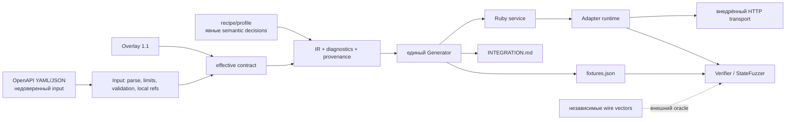
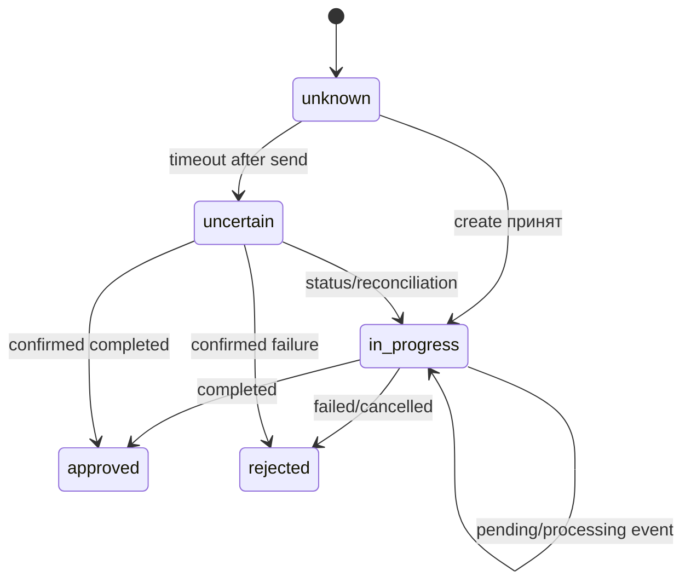

# Paygen: от машинно-читаемого контракта к проверяемому Ruby-адаптеру

**Статус исследования:** обновлено при интеграции 6 сентября 2026 года. Исторический baseline `92ef59bc2c8eb102c7452136ee4ea8a46887fd52` сохранён отдельно от новых E02–E05, независимой acceptance и mutation/replay. Каждый результат привязан к своему SHA и evidence; итоговый release report должен подтвердить финальную собранную версию. Необязательные E06/E08 остаются NOT_RUN и не блокируют приёмку прототипа.

## Резюме для команды

Paygen решает не задачу «автоматически написать платёжную платформу», а более узкую и проверяемую задачу: превратить OpenAPI-контракт и явно заданные предметные решения в согласованный комплект Ruby-сервиса, `INTEGRATION.md`, `fixtures.json` и служебных артефактов, после чего исполнить адаптер против локального HTTP-симулятора и проверить его фиксированными и последовательностными сценариями. [CASE] Интерфейс целевого сервиса включает `check_conditions`, `create_request`, `fetch_status` и `process_callback`; основной код должен оставаться Ruby, а ML внутри продукта запрещён. [Q&A] Логический `request_method` не является HTTP-глаголом, production `BaseService` не предоставляется, а подпись NovaPay вычисляется по точным байтам тела.

Главный инженерный вывод — OpenAPI достаточно для структуры HTTP-обмена, но недостаточно для безопасного восстановления всей платёжной семантики. Единицы суммы, отображение статусов, условная обязательность реквизитов, область идемпотентности, подпись callback и политика после неопределённого сетевого исхода должны приходить из проверяемого semantic profile/recipe либо оставаться диагностированным пробелом. [PROJECT POLICY] Неизвестное состояние не считается успехом; major→minor преобразуется без `Float`; отсутствие доказательств подписи нельзя компенсировать permissive fallback.

Реализован конвейер Input → Overlay → IR/profile/provenance → Generator → Adapter/Simulator/Verifier/StateFuzzer. Исторический полный RSpec-прогон дал 1119 примеров без отказов при seed 1016, coverage 89,46% строк и 74,76% ветвей. Новые отдельные evidence подтверждают regression slice 6/6, showcase 150 checks и пакет E02–E05; это разные наборы на разных SHA, их нельзя складывать в единый test count. В RSpec 703 примера относятся к JSONPath CTS, а не платёжным сценариям. Локальные результаты не подтверждают совместимость с закрытым backend, реальный provider sandbox, settlement, PCI DSS compliance или exactly-once между процессами.

Для защиты полезно формулировать вклад как **управляемую трассу решений**: исходная спецификация сохраняется, поправки отделены Overlay, выигравший источник каждого semantic fact отражён в provenance, а один effective contract порождает код, документацию и fixtures. Это уменьшает случайное расхождение артефактов, но не устраняет common-mode ошибку: неверный profile может одинаково исказить генератор, симулятор и документацию. Поэтому независимые wire vectors, отрицательные мутации и проверка реального sandbox остаются обязательными следующими ступенями.

## 1. Постановка задачи

Интеграция платёжного провайдера соединяет два неодинаковых контракта. С одной стороны находится HTTP API провайдера: paths, методы, параметры, схемы, security schemes и ответы. С другой — интерфейс host-приложения, жизненный цикл операции, словарь статусов и требования к callback. [CASE] Для NovaPay нужны создание выплаты, получение статуса, отмена, входящий webhook и баланс; авторизация использует `X-API-Key`, валюта — RUB, минимальная сумма создания — 100000 копеек. Получатель имеет ветви `sbp` и `card`: телефон обязателен, для SBP требуется `bank_code`, для карты — `card_number`. Статусы `pending`/`processing` отображаются в `in_progress`, `completed` — в `approved`, `failed`/`cancelled` — в `rejected`.

Результат хакатона — понятный CLI и три основных generated artifact. [CASE] Приведённая оценка ручной интеграции «2–5 дней» является исходной оценкой кейса, а не измеренным Paygen сокращением времени. [Q&A] CLI достаточен для оценки интерфейса; web-интерфейс факультативен. [CASE] Экспертные checkpoint-приоритеты суммируются в 100, тогда как перечисленные максимумы технического жюри арифметически дают 103 при заявленном итоге 100. Это расхождение сохранено, а не превращено в собственный scoring engine.

Граница результата принципиальна. Generated Ruby-класс и локальный reference harness не равны production-интеграции. Неизвестны конкретные исключения, транзакционные гарантии и форма закрытого `Provider::BaseService`; организаторы не обязаны предоставить harness. Явный совместимый hook `process_callback(payload, raw_body:, headers:)` нужен для проверки подписи по исходным байтам, но [PROJECT POLICY] его адаптацию к host следует согласовать. Старую сигнатуру нельзя поддерживать ценой отключения аутентичности.

## 2. Предметная область и источники неопределённости

**Payment** — перевод стоимости от плательщика, **payout** — выплата получателю, **provider** — внешняя система, а **adapter** переводит доменную команду host в wire request и wire response/event обратно в доменный результат. Эти определения не делают разные API взаимозаменяемыми: payout может быть синхронно принят, но ещё не исполнен и не рассчитан. HTTP 2xx способен означать принятие команды, а не settlement. Позднее возможны отказ, отмена или reversal; поэтому `approved` нельзя выводить из одного успешного транспорта без статусного правила.

Деньги требуют пары «значение + валюта + единица». Число `1000` неоднозначно без `RUB` и признака major/minor. Десятичный ввод нельзя пропускать через binary `Float`: умножение и неявное округление способны изменить минимальную единицу. В Paygen для точных преобразований применяется `BigDecimal`, а scale задаётся семантически. Политика должна определить допустимое число десятичных знаков и поведение при нецелом minor result; безопасный default — явный отказ, а не скрытое округление.

Idempotency тоже не является одним заголовком. Нужны scope ключа (credential/account/operation/action), TTL, правила сравнения повторного payload и durable storage. Timeout после отправки особенно опасен: провайдер мог commit-нуть выплату, хотя клиент не получил ответ. Без reconciliation повтор может удвоить выплату, а без durable coordination in-memory store не даёт cross-process exactly-once. Корректная политика — fail closed, повтор по тому же ключу только при доказанной повторяемости, затем status/reconciliation.

Webhook — недоверенный ввод. Проверка должна использовать exact raw body, нужные headers и secret, сравнивать MAC в constant-time режиме, а затем учитывать replay window, provider event ID и порядок. Дедупликация только по нормализованному статусу ошибочна: два подписанных события `pending` и `processing` оба дают `in_progress`, но могут нести разные metadata и последовательность. Синхронный callback-ответ также не доказывает, что событие устойчиво записано.

Ошибки делятся по крайней мере на validation, authentication, rate limit, provider business rejection, transient transport и ambiguous outcome. Они требуют различных retry/reconciliation решений. Неизвестный provider status должен быть ошибкой/диагностикой, а не success. Schema validation отбрасывает неверную форму, но не доказывает бизнес-смысл поля, полномочия credential или фактическое проведение денег.

## 3. Граница автоматизации

Рабочая модель имеет три слоя. Первый — **syntax/structure**: безопасно прочитать YAML/JSON, определить версию OpenAPI, разрешить локальные `$ref`, проверить schema и извлечь operations, parameters, media types и security declarations. OpenAPI описывает интерфейс, но текстовые `description` и примеры не становятся исполняемыми инструкциями. Внешний `$ref` — отдельный сетевой capability и потенциальный SSRF; uploaded `servers` не дают разрешения обращаться в сеть.

Второй слой — **semantic profile**. Он связывает provider fields с `amount`, `currency`, operation ID и recipient, задаёт amount unit/scale, status mapping, `required_if`, callback signature и логические actions. [Q&A] Общие overrides `amount_unit`, `required_if`, `signature_encoding` разрешены; provider-specific hardcode в ядре — нет. Explicit profile лучше эвристики: решение видно в diff, имеет provenance и может быть отвергнуто. LLM runtime не применяется: кроме требования кейса, вероятностный вывод критического правила неудобен для повторяемой проверки.

Третий слой — **runtime policy**: transport timeout, retry allowlist, state key, clock, verification и reconciliation. Его нельзя вывести только из OpenAPI. При неполном описании Paygen должен сообщить warning/TODO либо unsupported, а не подставить правдоподобную догадку. Поддержка OpenAPI 3.0/3.1, локальных refs, Overlay 1.1 и ограниченного Arazzo — конечный перечень возможностей, не обещание «любого OpenAPI/PDF».

## 4. Архитектура и доверительные границы

`Core::Input` ограничивает размер/глубину, использует safe YAML/JSON parsing и контролируемое разрешение ссылок. Это дешевле полноценного браузера remote refs и сознательно исключает скрытую сеть. JSONSchemer подходит для OpenAPI/schema validation, но validator не заменяет semantic binding. Для OpenAPI 3.0 и 3.1 важны различия schema dialect; нельзя механически приписать 3.0 весь JSON Schema 2020-12.

Overlay сохраняет исходник неизменным и записывает упорядоченные исправления отдельно. Janeway исполняет RFC 9535 JSONPath, поэтому selector не поддерживается кустарным подмножеством. Цена — необходимость валидировать Overlay, ограничивать complexity и диагностировать target без совпадений. Минимальная альтернатива — отредактировать копию OpenAPI, но тогда теряется различие между upstream fact и командным решением, сложнее обновлять snapshot.

IR объединяет inference, vendor extensions, recipe и integration profile с provenance победившего значения. Его следует понимать как нормализованное представление на Ruby Hash, а не объявлять immutable typed IR. Один Generator использует effective configuration для Ruby, guide и fixtures, снижая вероятность независимого ручного drift. Но общая генерация создаёт common-mode риск. Hash manifest обнаруживает изменения generated files; user-owned `extensions/` сохраняются и не исполняются во время генерации. Альтернатива — три шаблонных pipeline, однако тогда изменение mapping приходится синхронизировать вручную.

Runtime Adapter отделяет transport, clock и state store. Эти seams позволяют без внешнего платежа наблюдать request bytes, моделировать timeout и управлять временем callback. `OpenSSL` реализует HMAC, `BigDecimal` — точные суммы. Simulator — локальный provider, а Demo — приложение, действительно вызывающее generated adapter и simulator; прямой mock response не является таким доказательством. Puma/Rack обеспечивают локальный HTTP boundary. Reference `BaseService` полезен для воспроизводимости, но не доказывает неизвестный production interface.

Verifier сочетает schema/semantic assertions и отрицательные сценарии. `StateFuzzer` генерирует ограниченные последовательности действий, проверяет модель состояния, сокращает найденную трассу и поддерживает replay. Это собственный генератор/shrinker; PropCheck используется отдельно в отдельных RSpec properties и не является реализацией product fuzzer. Shrinking возвращает более короткий найденный контрпример, не гарантированно глобально минимальный.

### 4.1. Отвергнутые упрощения

Ручная генерация одного Ruby-класса из шаблона была бы быстрее для NovaPay, но закрепила бы mapping в коде и не дала бы общего доказательства согласованности документации и fixtures. Универсальный OpenAPI SDK generator, напротив, хорошо решает типизированный HTTP client, однако сам по себе не выбирает доменную грань между `processing` и `approved`, scope ключа идемпотентности или способ передачи exact callback bytes в host. Поэтому Paygen не конкурирует с каждым SDK по числу поддержанных языков: он добавляет контролируемый semantic и verification слой для данного Ruby-контракта.

Второе отвергнутое упрощение — извлекать критические правила из prose по ключевым словам. Оно удобно на демонстрации, но нестабильно при отрицаниях, локализации и неоднозначности. Description сохраняется как свидетельство для человека; автоматическое решение принимается лишь там, где действует явное, документированное правило. Неизвестное остаётся diagnostic. Общий overrides mechanism предпочтительнее NovaPay-ветки в parser, потому что новый provider добавляет данные, а не условие в core.

Наконец, одних фиксированных happy-path fixtures недостаточно: они редко представляют timeout-after-commit, повтор callback или перестановку событий. Но бесконечный random fuzz также непрактичен. Bounded state exploration с seed, бюджетом, shrink и replay даёт воспроизводимый компромисс. Его выводы намеренно ограничены моделью reducer и набором actions; deterministic examples остаются независимой основой, а не заменяются fuzzing.

## 5. Исследовательские вопросы и методика

| ID | Вопрос и operational definition | Метод и dataset | Метрика | Ограничение |
|---|---|---|---|---|
| RQ1 | Что извлекается структурно, а что требует profile? «Извлекается» означает одинаковый IR fact без provider hardcode. | OpenAPI 3.0/3.1 focused и native corpus; удалить semantic bindings и сравнить diagnostics. | Доля/перечень facts с origin inference против profile; blocker/warning. | Конечный corpus, не все API. |
| RQ2 | Уменьшает ли общий contract расхождение трёх артефактов? | Дважды сгенерировать один pinned input/profile/version; изменить mapping и проверить code/docs/fixtures независимыми assertions. | Byte equality, число inconsistent assertions, drift outcome. | Согласованность может одинаково воспроизвести ошибку. |
| RQ3 | Возможен ли отличающийся provider без core patch? | Onboarding native PayPal/Paystack на фиксированных snapshots и profiles; `git diff -- src/lib/`. | Executable profiles, core diff, unsupported diagnostics. | Не доказывает произвольный provider и production readiness. |
| RQ4 | Какие дефекты добавляет state testing? | Заранее зафиксированный mutation set; fixed examples, matched-budget stateless control и stateful sequences с одинаковым action budget/seeds. | Уникальные mutation kills; trace length до/после shrink; replay rate. | Несколько seeds не покрывают все состояния; без matched control причинность ограничена. |
| RQ5 | Какие ошибки отвергаются до side effect? | Invalid schema/amount/recipient/signature и instrumented transport/store. | Число invalid cases с нулём transport calls и mock mutations. | Не измеряет provider-side validation. |

Dataset фиксируется именем файла, SHA-256, license/provenance и tested commit. Focused профили NovaPay, Stripe, Adyen, PayPal и Raiffeisen не следует смешивать с native imports PayPal/Paystack или review-only T-Bank/Tochka. Independent wire examples должны быть написаны независимо от generated fixtures; иначе oracle повторит ту же ошибку. Выбор faulty corpus и mutation set фиксируется до запуска, включая невыгодные мутации. Для timings отдельно измеряются cold setup (пустой dependency/cache layer) и warm start; единичное время не обобщается.

## 6. Наблюдаемые результаты и уровни evidence

Исторический baseline — полный `src/run test` на `92ef59b…`, Linux x86_64, Ruby 3.4.4, seed 1016, WebMock с разрешённым localhost. Результат: **1119 examples, 0 failures**, 96,69 s внутри RSpec; line coverage 4098/4581 = 89,46%, branch coverage 1884/2520 = 74,76%. Raw log и exit code находятся в `research/evidence/`. Из 1119 примеров **703 — JSONPath CTS**, не платёжные сценарии. Интегратор сообщил промежуточный прогон 1141/0, seed 42570 на `09013a6…`; raw log не сохранён, поэтому это REPORTED, а не архивированный результат финальной версии.

Проверка доступности 11 первичных URL через `curl -L` дала HTTP 200 для каждого; это подтверждает доступ в момент проверки, но не содержание каждого claim. Код и lockfile подтверждают фактическое применение Ruby, JSONSchemer, Janeway, BigDecimal/OpenSSL, RSpec/WebMock/PropCheck, Rack/Puma и Diplodoc toolchain. Семь исполняемых профилей baseline и два native imports — разные категории; T-Bank/Tochka/corpus не считаются готовыми интеграциями.

Пакет `script/research-experiments` действительно выполняет E02–E05: сравнивает два независимых каталога генерации; проверяет semantic IR/config/fixtures для эквивалентных YAML и JSON; подтверждает отказ при ручном generated drift и сохранение extensions; импортирует native PayPal/Paystack и запускает independent HTTP examples без изменения core. Provenance bytes не сравниваются как бизнес-семантика. SHA, команды, окружение, входные/выходные hashes и логи сохраняются под `tmp/research-experiments/`.

На clean `b878e17…` независимая acceptance исполнила **6/6 probes** для пяти baseline-дефектов: tenant scope и rotation, workflow output preflight, различимые progress callbacks, decimal type preservation и root back-reference. Это post-fix evidence этих случаев, не новый red/green прогон каждого исторического дефекта. Последующий merge требует повторения acceptance.

Showcase на clean `75e0331…` исполнил **150 PASS checks**, включая команды и assertions. E07 имеет фактический отрицательный контроль: disposable subprocess с намеренно сломанной create reservation получил два provider commits; StateFuzzer при seed 4242 сохранил trace из 20 actions и сократил до 2. Replay mutant снова выявил `duplicate_payout`; обычный неизменённый adapter прошёл тот же persisted trace с тем же profile hash. Это demonstration generation/shrink/replay на одной мутации, не измерение чувствительности на полном mutation corpus.

Матрица результатов и hashes ранних integration artifacts находятся в `EXPERIMENTS.md` и `evidence/INTEGRATION_OBSERVATIONS.md`. E06 (matched-budget stateful/stateless comparison) и E08 (cold/warm timings) остаются **NOT_RUN, optional future study**. Нельзя заявлять доказанное превосходство stateful fuzzing, ускорение разработки или завершение всей программы. Docs gates и container commands существуют, но PASS сборки/OCI должен подтверждаться отдельным фактическим логом финального release, а не наличием workflow файла.

## 7. Угрозы валидности и безопасность

**Внутренняя валидность.** Generator, simulator, docs и generated fixtures питаются общим profile. Их взаимное согласие не является независимым подтверждением. Independent wire vectors уменьшают риск, но тоже могут основываться на той же неверно прочитанной документации. Provider sandbox и согласование с владельцем API остаются внешними проверками.

**Внешняя валидность.** Corpus curated и мал. Поддержка нескольких различающихся specs показывает переносимость в этих случаях, но не универсальность. Полные dialect/features OpenAPI, Overlay и Arazzo не реализуются автоматически. Private `BaseService`, реальные credential scopes, sandbox, settlement и reversal не проверены.

**Конструктивная валидность.** Большее число найденных ошибок после добавления stateful tests может быть следствием большего бюджета тестов. Нужен matched-budget stateless control. Coverage показывает исполненные строки/ветви, но не полноту бизнес-состояний. Успех локального HTTP запроса доказывает transport path, не перевод денег.

**Воспроизводимость.** Seed и общий action budget обязательны; один seed не означает все состояния. Shrunk trace называется сокращённым, не минимальным. Timings зависят от CPU, filesystem, gem/npm cache и сети. Любой результат после merge должен быть повторён на merge SHA.

**Threat model.** Spec/profile/Overlay/Arazzo считаются недоверенными данными. Парсеры имеют limits/timeouts; внешние refs и `servers` не должны инициировать сеть без отдельного разрешения. YAML не выполняет Ruby; extensions — доверенный user-owned код и загружаются host явно. Secrets, raw PAN/CVV и callback bodies не должны попадать в документацию или логи. Допустимы только помеченные синтетические cards; replay хранит fixture ID+version/hash, а не необратимо маскированный вход. HMAC проверяется до доверия payload; неизвестная signature encoding блокирует callback.

Шифрование или masking сами по себе не выводят систему из PCI DSS scope: он зависит от реальной архитектуры и применимых требований. Этот prototype не заявляет PCI compliance. In-memory store не даёт cross-process exactly-once; для такого утверждения нужны durable coordination, crash model и transaction contract.

## 8. Заключение и конечный roadmap

Paygen демонстрирует практический компромисс между ручной интеграцией и небезопасной полной автоматизацией. Машинно-читаемый контракт задаёт структуру; profile фиксирует предметные решения; Overlay отделяет upstream от поправок; provenance объясняет происхождение; общий generator синхронизирует артефакты; transport/state/clock seams делают локальное поведение наблюдаемым; verifier и bounded state fuzz проверяют позитивные и негативные траектории. Эта архитектура предпочтительнее обычного SDK generation для поставленной задачи не потому, что SDK generators «не умеют платежи», а потому, что здесь дополнительно проверены semantic bindings, callback raw bytes, state policies и согласованная документация/fixtures.

Практический workflow: pin source и hash → inspect diagnostics → применить reviewable Overlay → заполнить semantic profile без догадок → generate → проверить drift → исполнить adapter через loopback simulator → прогнать independent vectors, faults и replay → вручную согласовать backend hooks → проверить provider sandbox → только затем проектировать production storage, observability и compliance. Для сдачи интегрированной версии нужны свежие release evidence на её SHA: suite, независимые regression probes, showcase/replay и docs/smoke gates. Их достаточность определяет release acceptance, а не необязательная исследовательская программа. E06/E08 разумно оставить будущей работой; production storage, private backend, sandbox и compliance требуют самостоятельной проверки вне локального прототипа.
